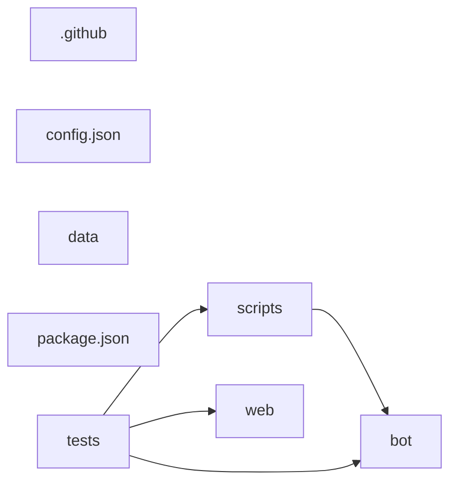

# NOREX system layers

Generated from local source imports. Arrows mean **depends on**, not runtime calls.

```mermaid
flowchart LR
  n0[".github"]
  n1["bot"]
  n2["config.json"]
  n3["data"]
  n4["package.json"]
  n5["scripts"]
  n6["tests"]
  n7["web"]
  n5 --> n1
  n6 --> n1
  n6 --> n5
  n6 --> n7
```
