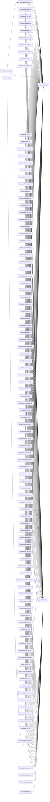

# tests module dependencies

Source-level imports; isolated files appear without arrows.

```mermaid
flowchart LR
  n0["tests/aiinsights.test.mjs"]
  n1["tests/aispike.test.mjs"]
  n2["tests/alertroute.test.mjs"]
  n3["tests/ask.test.mjs"]
  n4["tests/aura.test.mjs"]
  n5["tests/avatarcard.test.mjs"]
  n6["tests/awards.test.mjs"]
  n7["tests/badges.test.mjs"]
  n8["tests/bot.test.mjs"]
  n9["tests/botcommands.test.mjs"]
  n10["tests/botfeat-sample.mjs"]
  n11["tests/builder.test.mjs"]
  n12["tests/builds.test.mjs"]
  n13["tests/burners-api.test.mjs"]
  n14["tests/burners.test.mjs"]
  n15["tests/cardstudio.test.mjs"]
  n16["tests/chat.test.mjs"]
  n17["tests/checkin.test.mjs"]
  n18["tests/clublookup.test.mjs"]
  n19["tests/crawl.test.mjs"]
  n20["tests/d1usage.test.mjs"]
  n21["tests/design.test.mjs"]
  n22["tests/discord.test.mjs"]
  n23["tests/discoveries.test.mjs"]
  n24["tests/docs.test.mjs"]
  n25["tests/drilldown.test.mjs"]
  n26["tests/dugout.test.mjs"]
  n27["tests/eventdecode.test.mjs"]
  n28["tests/events-ui.test.mjs"]
  n29["tests/events.test.mjs"]
  n30["tests/extradata.test.mjs"]
  n31["tests/faces-api.test.mjs"]
  n32["tests/feed.test.mjs"]
  n33["tests/feedbackroom.test.mjs"]
  n34["tests/flags.test.mjs"]
  n35["tests/fun.test.mjs"]
  n36["tests/game.test.mjs"]
  n37["tests/honours.test.mjs"]
  n38["tests/host.test.mjs"]
  n39["tests/hub.test.mjs"]
  n40["tests/hublive.test.mjs"]
  n41["tests/hype.test.mjs"]
  n42["tests/insights.test.mjs"]
  n43["tests/insightwidget.test.mjs"]
  n44["tests/intel.test.mjs"]
  n45["tests/issues.test.mjs"]
  n46["tests/issuesrec.test.mjs"]
  n47["tests/issuessync.test.mjs"]
  n48["tests/lib.mjs"]
  n49["tests/lineuprec.test.mjs"]
  n50["tests/live.test.mjs"]
  n51["tests/locker.test.mjs"]
  n52["tests/matchpicture.test.mjs"]
  n53["tests/matchreview.test.mjs"]
  n54["tests/media.test.mjs"]
  n55["tests/memberlive.test.mjs"]
  n56["tests/members.test.mjs"]
  n57["tests/mock.mjs"]
  n58["tests/moderation.test.mjs"]
  n59["tests/monitor.test.mjs"]
  n60["tests/next-quality.test.mjs"]
  n61["tests/next-runtime.test.mjs"]
  n62["tests/next.test.mjs"]
  n63["tests/notifcenter.test.mjs"]
  n64["tests/notify.test.mjs"]
  n65["tests/packs.test.mjs"]
  n66["tests/panel.test.mjs"]
  n67["tests/phonefix.test.mjs"]
  n68["tests/playmedia.test.mjs"]
  n69["tests/plays.test.mjs"]
  n70["tests/points.test.mjs"]
  n71["tests/polish.test.mjs"]
  n72["tests/prefs.test.mjs"]
  n73["tests/probuilds.test.mjs"]
  n74["tests/profanity.test.mjs"]
  n75["tests/profiles.test.mjs"]
  n76["tests/push.test.mjs"]
  n77["tests/pwa.test.mjs"]
  n78["tests/quickcommands.test.mjs"]
  n79["tests/rankings.test.mjs"]
  n80["tests/recorder.test.mjs"]
  n81["tests/redirects.test.mjs"]
  n82["tests/reminders.test.mjs"]
  n83["tests/resultpost.test.mjs"]
  n84["tests/rosterpic.test.mjs"]
  n85["tests/run.mjs"]
  n86["tests/rush.test.mjs"]
  n87["tests/servertools.test.mjs"]
  n88["tests/site.test.mjs"]
  n89["tests/social.test.mjs"]
  n90["tests/squads.test.mjs"]
  n91["tests/stars.test.mjs"]
  n92["tests/statinsights.test.mjs"]
  n93["tests/streamalerts.test.mjs"]
  n94["tests/studio.test.mjs"]
  n95["tests/submissions.test.mjs"]
  n96["tests/tagline.test.mjs"]
  n97["tests/trials.test.mjs"]
  n98["tests/updates.test.mjs"]
  n99["tests/voicerecap.test.mjs"]
  n100["tests/watchlist.test.mjs"]
  n101["tests/wave10.test.mjs"]
  n102["tests/wave11.test.mjs"]
  n103["tests/wave8.test.mjs"]
  n0 --> n48
  n0 --> n57
  n1 --> n48
  n1 --> n57
  n2 --> n48
  n2 --> n57
  n3 --> n48
  n4 --> n48
  n4 --> n57
  n5 --> n48
  n5 --> n57
  n6 --> n48
  n6 --> n57
  n7 --> n48
  n7 --> n57
  n8 --> n48
  n8 --> n57
  n9 --> n48
  n9 --> n57
  n10 --> n57
  n11 --> n48
  n11 --> n57
  n12 --> n48
  n12 --> n57
  n13 --> n48
  n13 --> n57
  n14 --> n48
  n14 --> n57
  n15 --> n48
  n15 --> n57
  n16 --> n48
  n16 --> n57
  n17 --> n48
  n17 --> n57
  n18 --> n48
  n18 --> n57
  n19 --> n48
  n19 --> n57
  n20 --> n48
  n20 --> n57
  n21 --> n48
  n21 --> n57
  n22 --> n48
  n22 --> n57
  n23 --> n48
  n23 --> n57
  n24 --> n48
  n24 --> n57
  n25 --> n48
  n25 --> n57
  n26 --> n48
  n26 --> n57
  n27 --> n48
  n28 --> n48
  n28 --> n57
  n29 --> n48
  n29 --> n57
  n30 --> n48
  n31 --> n48
  n31 --> n57
  n32 --> n48
  n32 --> n57
  n33 --> n48
  n33 --> n57
  n34 --> n48
  n34 --> n57
  n35 --> n48
  n35 --> n57
  n36 --> n48
  n36 --> n57
  n37 --> n48
  n37 --> n57
  n38 --> n48
  n38 --> n57
  n39 --> n48
  n39 --> n57
  n40 --> n48
  n40 --> n57
  n41 --> n48
  n41 --> n57
  n42 --> n48
  n42 --> n57
  n43 --> n48
  n43 --> n57
  n44 --> n48
  n44 --> n57
  n45 --> n48
  n45 --> n57
  n46 --> n48
  n46 --> n57
  n47 --> n48
  n47 --> n57
  n49 --> n48
  n49 --> n57
  n50 --> n48
  n50 --> n57
  n51 --> n48
  n51 --> n57
  n52 --> n48
  n52 --> n57
  n53 --> n48
  n54 --> n48
  n54 --> n57
  n55 --> n48
  n55 --> n57
  n56 --> n48
  n56 --> n57
  n58 --> n48
  n58 --> n57
  n59 --> n48
  n59 --> n57
  n60 --> n48
  n60 --> n57
  n61 --> n48
  n61 --> n57
  n62 --> n10
  n62 --> n48
  n62 --> n57
  n63 --> n48
  n63 --> n57
  n64 --> n48
  n64 --> n57
  n65 --> n48
  n65 --> n57
  n66 --> n48
  n66 --> n57
  n67 --> n48
  n67 --> n57
  n68 --> n48
  n68 --> n57
  n69 --> n48
  n69 --> n57
  n70 --> n48
  n70 --> n57
  n71 --> n48
  n71 --> n57
  n72 --> n48
  n72 --> n57
  n73 --> n48
  n73 --> n57
  n74 --> n48
  n74 --> n57
  n75 --> n48
  n75 --> n57
  n76 --> n48
  n76 --> n57
  n77 --> n48
  n77 --> n57
  n78 --> n48
  n78 --> n57
  n79 --> n48
  n80 --> n48
  n80 --> n57
  n81 --> n48
  n82 --> n48
  n82 --> n57
  n83 --> n48
  n84 --> n48
  n84 --> n57
  n86 --> n48
  n86 --> n57
  n87 --> n48
  n87 --> n57
  n88 --> n48
  n88 --> n57
  n89 --> n48
  n89 --> n57
  n90 --> n48
  n90 --> n57
  n91 --> n48
  n92 --> n48
  n92 --> n57
  n93 --> n48
  n93 --> n57
  n94 --> n48
  n94 --> n57
  n95 --> n48
  n95 --> n57
  n96 --> n48
  n96 --> n57
  n97 --> n48
  n97 --> n57
  n98 --> n48
  n98 --> n57
  n99 --> n48
  n99 --> n57
  n100 --> n48
  n100 --> n57
  n101 --> n48
  n101 --> n57
  n102 --> n48
  n102 --> n57
  n103 --> n48
  n103 --> n57
```
