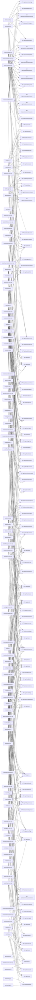

# API source connections

Static source references; this does not prove runtime invocation or SQL lineage. Top 100 by reference count.

```mermaid
flowchart LR
  n0["API /api/achievements"]
  n1["API /api/achievements/board"]
  n2["API /api/achievements/seen"]
  n3["API /api/admin/claims"]
  n4["API /api/admin/flags"]
  n5["API /api/admin/flags/reset"]
  n6["API /api/admin/health"]
  n7["API /api/admin/mute"]
  n8["API /api/admin/overview"]
  n9["API /api/admin/reports"]
  n10["API /api/admin/requests"]
  n11["API /api/admin/requests/decide"]
  n12["API /api/admin/squadweek"]
  n13["API /api/admin/warn"]
  n14["API /api/availability"]
  n15["API /api/avatarcard"]
  n16["API /api/awards"]
  n17["API /api/awards/board"]
  n18["API /api/awards/category"]
  n19["API /api/awards/category/remove"]
  n20["API /api/awards/close"]
  n21["API /api/awards/settings"]
  n22["API /api/awards/vote"]
  n23["API /api/badges"]
  n24["API /api/badges/remove"]
  n25["API /api/bot/settings"]
  n26["API /api/builds"]
  n27["API /api/builds/delete"]
  n28["API /api/builds/fork"]
  n29["API /api/builds/impact"]
  n30["API /api/cards/kit-number"]
  n31["API /api/cards/owner/requests"]
  n32["API /api/cards/owner/revoke"]
  n33["API /api/cards/request"]
  n34["API /api/cards/request/cancel"]
  n35["API /api/cards/requests"]
  n36["API /api/cards/requests/decide"]
  n37["API /api/cards/requests/retry"]
  n38["API /api/cards/requests/review"]
  n39["API /api/cards/templates"]
  n40["API /api/cards/templates/update"]
  n41["API /api/chats"]
  n42["API /api/claim"]
  n43["API /api/contacts"]
  n44["API /api/crawl"]
  n45["API /api/docs"]
  n46["API /api/docs/ack"]
  n47["API /api/docs/acks"]
  n48["API /api/docs/discord"]
  n49["API /api/docs/remind"]
  n50["API /api/docs/remove"]
  n51["API /api/docs/restore"]
  n52["API /api/events"]
  n53["API /api/events/cancel"]
  n54["API /api/events/checkin"]
  n55["API /api/events/discord"]
  n56["API /api/events/lineup"]
  n57["API /api/events/nudge"]
  n58["API /api/events/plays"]
  n59["API /api/events/recommend"]
  n60["API /api/events/report/post"]
  n61["API /api/events/rsvp"]
  n62["API /api/events/templates"]
  n63["API /api/feed"]
  n64["API /api/feed/comment"]
  n65["API /api/feed/delete"]
  n66["API /api/feed/edit"]
  n67["API /api/feed/media/delete"]
  n68["API /api/feed/post"]
  n69["API /api/feed/report"]
  n70["API /api/feed/uncomment"]
  n71["API /api/feed/unreport"]
  n72["API /api/feedback/hide"]
  n73["API /api/feedback/send"]
  n74["API /api/game/publish"]
  n75["API /api/hof"]
  n76["API /api/hub/wave"]
  n77["API /api/locker"]
  n78["API /api/me"]
  n79["API /api/mybuild"]
  n80["API /api/notify"]
  n81["API /api/notify/ack"]
  n82["API /api/notify/announce"]
  n83["API /api/notify/count"]
  n84["API /api/notify/read"]
  n85["API /api/plays"]
  n86["API /api/playstyle"]
  n87["API /api/probuilds"]
  n88["API /api/profile"]
  n89["API /api/ratings/rate"]
  n90["API /api/rush"]
  n91["API /api/rush/decide"]
  n92["API /api/rush/queue"]
  n93["API /api/scout"]
  n94["API /api/suggestions"]
  n95["API /api/trials"]
  n96["API /api/trials/add"]
  n97["API /api/trials/apply"]
  n98["API /api/trials/update"]
  n99["API /api/vote"]
  n100["bot/awards.js"]
  n101["bot/badges.js"]
  n102["bot/botcmds.js"]
  n103["bot/builds.js"]
  n104["bot/cardstudio.js"]
  n105["bot/chat.js"]
  n106["bot/docs.js"]
  n107["bot/events.js"]
  n108["bot/feed.js"]
  n109["bot/feedback.js"]
  n110["bot/game.js"]
  n111["bot/honours.js"]
  n112["bot/hub.js"]
  n113["bot/lineuprec.js"]
  n114["bot/locker.js"]
  n115["bot/media.js"]
  n116["bot/members.js"]
  n117["bot/notify.js"]
  n118["bot/plays.js"]
  n119["bot/probuilds.js"]
  n120["bot/ratings.js"]
  n121["bot/settings.js"]
  n122["bot/trials.js"]
  n123["tests/avatarcard.test.mjs"]
  n124["tests/awards.test.mjs"]
  n125["tests/badges.test.mjs"]
  n126["tests/builder.test.mjs"]
  n127["tests/builds.test.mjs"]
  n128["tests/cardstudio.test.mjs"]
  n129["tests/chat.test.mjs"]
  n130["tests/clublookup.test.mjs"]
  n131["tests/crawl.test.mjs"]
  n132["tests/discord.test.mjs"]
  n133["tests/docs.test.mjs"]
  n134["tests/drilldown.test.mjs"]
  n135["tests/dugout.test.mjs"]
  n136["tests/events.test.mjs"]
  n137["tests/feed.test.mjs"]
  n138["tests/flags.test.mjs"]
  n139["tests/game.test.mjs"]
  n140["tests/honours.test.mjs"]
  n141["tests/hub.test.mjs"]
  n142["tests/hublive.test.mjs"]
  n143["tests/lineuprec.test.mjs"]
  n144["tests/locker.test.mjs"]
  n145["tests/media.test.mjs"]
  n146["tests/members.test.mjs"]
  n147["tests/moderation.test.mjs"]
  n148["tests/next.test.mjs"]
  n149["tests/notify.test.mjs"]
  n150["tests/playmedia.test.mjs"]
  n151["tests/plays.test.mjs"]
  n152["tests/probuilds.test.mjs"]
  n153["tests/profiles.test.mjs"]
  n154["tests/rush.test.mjs"]
  n155["tests/social.test.mjs"]
  n156["tests/squads.test.mjs"]
  n157["tests/studio.test.mjs"]
  n158["tests/submissions.test.mjs"]
  n159["tests/trials.test.mjs"]
  n160["tests/wave10.test.mjs"]
  n161["tests/wave11.test.mjs"]
  n162["tests/wave8.test.mjs"]
  n163["web/app.js"]
  n164["web/avatarcard.js"]
  n165["web/awards.js"]
  n166["web/badges.js"]
  n167["web/boardroom.js"]
  n168["web/builder.js"]
  n169["web/cardstudio.js"]
  n170["web/docs.js"]
  n171["web/dugout.js"]
  n172["web/events.js"]
  n173["web/feed.js"]
  n174["web/feedback.js"]
  n175["web/game.js"]
  n176["web/honours.js"]
  n177["web/hub.js"]
  n178["web/hubgold.js"]
  n179["web/hublive.js"]
  n180["web/locker.js"]
  n181["web/messages.js"]
  n182["web/mystats.js"]
  n183["web/notify.js"]
  n184["web/probuilds.js"]
  n185["web/profile.js"]
  n186["web/ratings.js"]
  n187["web/settings.js"]
  n188["web/squads.js"]
  n189["web/tactics.js"]
  n190["web/trials.js"]
  n100 --> n16
  n100 --> n17
  n100 --> n18
  n100 --> n19
  n100 --> n20
  n100 --> n21
  n100 --> n22
  n101 --> n0
  n101 --> n1
  n101 --> n2
  n101 --> n23
  n101 --> n24
  n102 --> n73
  n102 --> n82
  n102 --> n94
  n103 --> n26
  n103 --> n27
  n103 --> n28
  n103 --> n29
  n104 --> n30
  n104 --> n31
  n104 --> n32
  n104 --> n33
  n104 --> n34
  n104 --> n35
  n104 --> n36
  n104 --> n37
  n104 --> n38
  n104 --> n39
  n104 --> n40
  n105 --> n41
  n106 --> n45
  n106 --> n46
  n106 --> n47
  n106 --> n48
  n106 --> n49
  n106 --> n50
  n106 --> n51
  n106 --> n86
  n106 --> n94
  n107 --> n52
  n107 --> n53
  n107 --> n54
  n107 --> n55
  n107 --> n56
  n107 --> n57
  n107 --> n58
  n107 --> n59
  n107 --> n60
  n107 --> n61
  n107 --> n62
  n108 --> n63
  n108 --> n64
  n108 --> n65
  n108 --> n66
  n108 --> n68
  n108 --> n69
  n108 --> n70
  n108 --> n71
  n109 --> n72
  n109 --> n73
  n110 --> n74
  n111 --> n75
  n112 --> n76
  n113 --> n59
  n114 --> n77
  n115 --> n67
  n116 --> n3
  n116 --> n4
  n116 --> n5
  n116 --> n6
  n116 --> n7
  n116 --> n8
  n116 --> n9
  n116 --> n12
  n116 --> n13
  n116 --> n14
  n116 --> n15
  n116 --> n33
  n116 --> n42
  n116 --> n43
  n116 --> n44
  n116 --> n45
  n116 --> n75
  n116 --> n78
  n116 --> n87
  n116 --> n88
  n116 --> n90
  n116 --> n91
  n116 --> n92
  n116 --> n97
  n116 --> n99
  n117 --> n10
  n117 --> n11
  n117 --> n80
  n117 --> n81
  n117 --> n82
  n117 --> n83
  n117 --> n84
  n118 --> n85
  n119 --> n79
  n119 --> n87
  n120 --> n89
  n121 --> n25
  n122 --> n93
  n122 --> n95
  n122 --> n96
  n122 --> n98
  n123 --> n15
  n124 --> n16
  n124 --> n17
  n124 --> n18
  n124 --> n19
  n124 --> n20
  n124 --> n21
  n124 --> n22
  n124 --> n80
  n125 --> n0
  n125 --> n1
  n125 --> n2
  n125 --> n3
  n125 --> n23
  n125 --> n24
  n125 --> n42
  n125 --> n88
  n126 --> n28
  n127 --> n8
  n127 --> n26
  n127 --> n27
  n127 --> n28
  n128 --> n30
  n128 --> n31
  n128 --> n32
  n128 --> n33
  n128 --> n34
  n128 --> n35
  n128 --> n36
  n128 --> n37
  n128 --> n38
  n128 --> n39
  n128 --> n40
  n129 --> n41
  n130 --> n44
  n131 --> n6
  n131 --> n44
  n132 --> n3
  n132 --> n78
  n133 --> n45
  n133 --> n46
  n133 --> n47
  n133 --> n48
  n133 --> n49
  n133 --> n50
  n133 --> n51
  n133 --> n80
  n133 --> n81
  n133 --> n83
  n133 --> n86
  n133 --> n94
  n134 --> n41
  n135 --> n52
  n135 --> n54
  n135 --> n56
  n135 --> n58
  n135 --> n61
  n135 --> n85
  n135 --> n98
  n136 --> n8
  n136 --> n52
  n136 --> n53
  n136 --> n54
  n136 --> n56
  n136 --> n57
  n136 --> n60
  n136 --> n61
  n136 --> n80
  n136 --> n88
  n137 --> n63
  n137 --> n64
  n137 --> n65
  n137 --> n66
  n137 --> n68
  n137 --> n69
  n137 --> n70
  n137 --> n71
  n138 --> n4
  n138 --> n5
  n138 --> n6
  n138 --> n8
  n138 --> n25
  n138 --> n75
  n138 --> n78
  n138 --> n82
  n138 --> n90
  n138 --> n92
  n139 --> n8
  n139 --> n74
  n140 --> n75
  n141 --> n76
  n141 --> n80
  n142 --> n76
  n143 --> n52
  n143 --> n56
  n143 --> n59
  n143 --> n61
  n144 --> n22
  n144 --> n58
  n144 --> n61
  n144 --> n77
  n144 --> n84
  n144 --> n85
  n144 --> n99
  n145 --> n63
  n145 --> n65
  n145 --> n66
  n145 --> n67
  n145 --> n68
  n146 --> n3
  n146 --> n8
  n146 --> n12
  n146 --> n14
  n146 --> n42
  n146 --> n78
  n146 --> n88
  n146 --> n99
  n147 --> n7
  n147 --> n8
  n147 --> n9
  n147 --> n13
  n147 --> n41
  n147 --> n63
  n147 --> n64
  n147 --> n68
  n147 --> n69
  n147 --> n71
  n148 --> n45
  n148 --> n46
  n148 --> n86
  n149 --> n3
  n149 --> n10
  n149 --> n11
  n149 --> n42
  n149 --> n80
  n149 --> n81
  n149 --> n82
  n149 --> n83
  n149 --> n84
  n149 --> n90
  n149 --> n91
  n149 --> n93
  n149 --> n95
  n149 --> n96
  n149 --> n97
  n149 --> n98
  n150 --> n85
  n151 --> n85
  n152 --> n8
  n152 --> n26
  n152 --> n27
  n152 --> n79
  n152 --> n87
  n153 --> n8
  n153 --> n78
  n153 --> n88
  n154 --> n8
  n154 --> n90
  n154 --> n91
  n154 --> n92
  n155 --> n63
  n155 --> n64
  n155 --> n66
  n155 --> n68
  n155 --> n70
  n156 --> n80
  n156 --> n88
  n157 --> n85
  n158 --> n16
  n158 --> n22
  n158 --> n26
  n158 --> n73
  n158 --> n89
  n158 --> n94
  n159 --> n8
  n159 --> n43
  n159 --> n93
  n159 --> n95
  n159 --> n96
  n159 --> n97
  n159 --> n98
  n160 --> n72
  n160 --> n73
  n160 --> n80
  n160 --> n89
  n161 --> n26
  n161 --> n29
  n161 --> n74
  n161 --> n80
  n162 --> n42
  n162 --> n52
  n162 --> n56
  n162 --> n61
  n162 --> n62
  n162 --> n80
  n163 --> n3
  n163 --> n4
  n163 --> n5
  n163 --> n6
  n163 --> n7
  n163 --> n8
  n163 --> n9
  n163 --> n12
  n163 --> n13
  n163 --> n14
  n163 --> n42
  n163 --> n65
  n163 --> n71
  n163 --> n72
  n163 --> n77
  n163 --> n78
  n163 --> n88
  n163 --> n90
  n163 --> n91
  n163 --> n92
  n163 --> n99
  n164 --> n15
  n165 --> n16
  n165 --> n17
  n165 --> n18
  n165 --> n19
  n165 --> n20
  n165 --> n21
  n165 --> n22
  n165 --> n55
  n166 --> n0
  n166 --> n1
  n166 --> n2
  n166 --> n23
  n166 --> n24
  n167 --> n4
  n167 --> n5
  n167 --> n6
  n167 --> n75
  n167 --> n82
  n168 --> n26
  n168 --> n27
  n168 --> n28
  n168 --> n29
  n168 --> n79
  n169 --> n30
  n169 --> n31
  n169 --> n32
  n169 --> n33
  n169 --> n34
  n169 --> n35
  n169 --> n36
  n169 --> n37
  n169 --> n38
  n169 --> n39
  n169 --> n40
  n170 --> n45
  n170 --> n46
  n170 --> n47
  n170 --> n48
  n170 --> n49
  n170 --> n50
  n170 --> n51
  n170 --> n86
  n170 --> n94
  n171 --> n52
  n171 --> n56
  n171 --> n58
  n171 --> n85
  n171 --> n95
  n171 --> n98
  n172 --> n52
  n172 --> n53
  n172 --> n54
  n172 --> n55
  n172 --> n56
  n172 --> n57
  n172 --> n59
  n172 --> n60
  n172 --> n61
  n172 --> n62
  n173 --> n48
  n173 --> n64
  n173 --> n65
  n173 --> n66
  n173 --> n67
  n173 --> n68
  n173 --> n69
  n173 --> n70
  n173 --> n71
  n174 --> n72
  n174 --> n73
  n175 --> n74
  n176 --> n75
  n177 --> n78
  n178 --> n77
  n178 --> n78
  n179 --> n76
  n180 --> n61
  n180 --> n77
  n180 --> n99
  n181 --> n41
  n182 --> n0
  n182 --> n90
  n183 --> n10
  n183 --> n11
  n183 --> n80
  n183 --> n81
  n183 --> n82
  n183 --> n83
  n183 --> n84
  n184 --> n79
  n184 --> n87
  n185 --> n88
  n186 --> n89
  n187 --> n25
  n188 --> n55
  n189 --> n85
  n190 --> n43
  n190 --> n93
  n190 --> n95
  n190 --> n96
  n190 --> n97
  n190 --> n98
```
